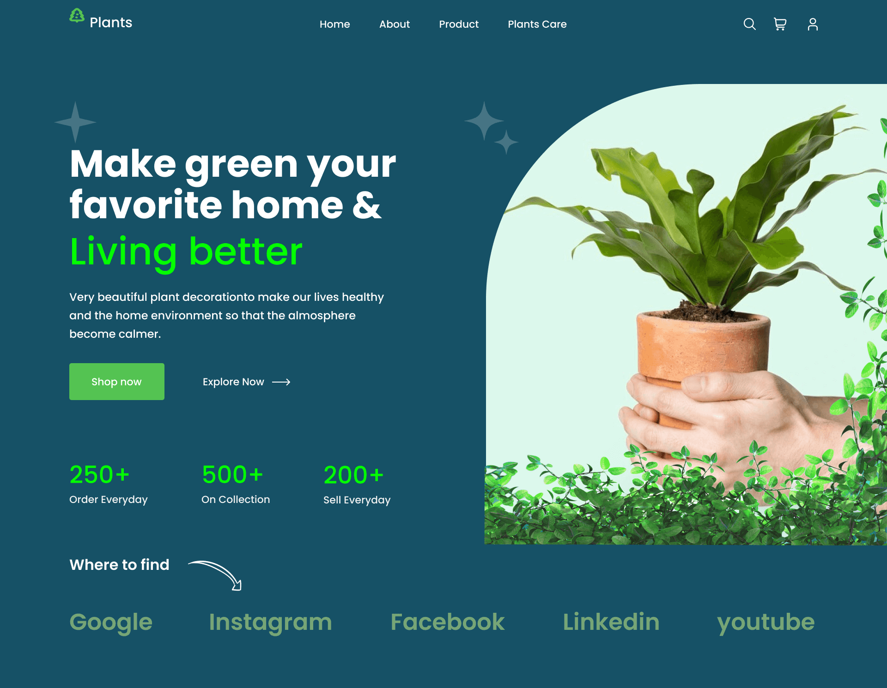

# Верстка макета

Источник макета Telegram-канал [FIGMA | Макеты для верстки](https://t.me/+oXZSKMmXp6UyOGI6)

#### Исходные данные

- [Макет проекта в Figma](https://www.figma.com/file/5J9axIvb7Zs5jZNsXWEAlI/landing?type=design&node-id=0%3A1&mode=design&t=t6voa2tnNY6zd4VC-1)
- [Заготовка для верстки макетов Telegram-канала `FIGMA | Макеты для верстки`](https://github.com/MaketForFigma/Template)

#### Описание проекта

- первая страница (лендинг) компании Plants на английском языке
- макет без адаптива для экрана 1920px
- верстка на HTML и CSS
- подключение шрифтов с google fonts
- БЭМ-нейминг классов
- flex-сетка
- псевдоэлементы
- логические CSS-свойства
- добавлены состояния элементов hover, focus и focus-visible

#### Превью страницы

#### Проект можно посмотреть
- [можно открыть на gh-pages]()
- если скачать репозиторий к себе: просто открыть в браузере файл `index.html`
